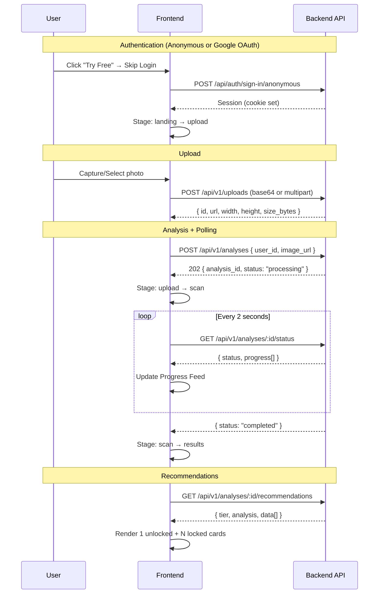

# Design Document: Frontend API Integration

## Overview

This design covers the integration of the FindMyCut React 19 frontend with the Hono backend API for the Free Tier user flow. The frontend currently uses hardcoded data and mock state transitions — this integration replaces those with real API calls, session management via better-auth, a polling mechanism for AI analysis progress, and a Progress Feed UI component.

The integration spans:
- **Authentication**: Anonymous sessions and Google OAuth via better-auth client
- **Upload**: Selfie upload via base64 (camera) or multipart/form-data (gallery)
- **Analysis**: Triggering AI pipeline and polling for progress
- **Progress Feed**: Real-time display of agent steps with status icons
- **Recommendations**: Fetching and displaying results with free-tier locking
- **API Client**: Centralized fetch configuration with credentials and error handling

## Architecture

```mermaid
graph TD
    subgraph Frontend [React 19 + Vite 8]
        AC[Auth Client<br/>better-auth/react]
        API[API Client<br/>fetch wrapper]
        SM[Stage Machine]
        PF[Progress Feed]
        UI[UI Components]
    end

    subgraph Backend [Hono API - localhost:3000]
        AUTH[/api/auth/*<br/>better-auth]
        UPLOAD[/api/v1/uploads]
        ANALYSIS[/api/v1/analyses]
        STATUS[/api/v1/analyses/:id/status]
        RECS[/api/v1/analyses/:id/recommendations]
    end

    AC -->|sign-in/sign-out/get-session| AUTH
    API -->|POST image| UPLOAD
    API -->|POST trigger| ANALYSIS
    API -->|GET poll| STATUS
    API -->|GET results| RECS
    SM -->|stage transitions| UI
    STATUS -->|progress entries| PF
```

### Flow Sequence



## Components and Interfaces

### 1. API Client (`src/lib/api-client.ts`)

A thin fetch wrapper that centralizes base URL, credentials, and error handling.

```typescript
interface ApiClientConfig {
  baseUrl: string; // from VITE_API_URL or fallback
}

interface ApiResponse<T> {
  data: T | null;
  error: string | null;
  status: number;
}

// Methods:
// get<T>(path: string): Promise<ApiResponse<T>>
// post<T>(path: string, body?: unknown): Promise<ApiResponse<T>>
// postFormData<T>(path: string, formData: FormData): Promise<ApiResponse<T>>
```

All requests include `credentials: "include"` for cookie-based auth. On 401 responses from `/api/v1/*`, the client triggers session expiry handling.

### 2. Auth Hook (`src/hooks/useAuth.ts`)

Wraps better-auth client methods and manages user state.

```typescript
interface AuthState {
  user: UserProfile | null;
  isLoading: boolean;
  isAuthenticated: boolean;
  isAnonymous: boolean;
}

interface UserProfile {
  id: string;
  name: string;
  email: string;
  image: string | null;
  tier: string;
  isAnonymous: boolean;
}

// Methods:
// signInAnonymous(): Promise<void>
// signInGoogle(): Promise<void>
// signOut(): Promise<void>
// refreshSession(): Promise<void>
```

### 3. Upload Hook (`src/hooks/useUpload.ts`)

Handles image upload with validation and state management.

```typescript
interface UploadState {
  isUploading: boolean;
  uploadResult: UploadResult | null;
  error: string | null;
}

interface UploadResult {
  id: string;
  url: string;
  width: number;
  height: number;
  size_bytes: number;
}

// Methods:
// uploadBase64(dataUrl: string): Promise<UploadResult>
// uploadFile(file: File): Promise<UploadResult>
// validateFile(file: File): ValidationResult
```

### 4. Analysis Hook (`src/hooks/useAnalysis.ts`)

Manages analysis lifecycle: trigger, poll, timeout, retry.

```typescript
interface AnalysisState {
  analysisId: string | null;
  status: "idle" | "processing" | "completed" | "failed" | "timeout";
  progress: ProgressEntry[];
  error: string | null;
}

interface ProgressEntry {
  agent: string;
  step: string;
  message: string;
  tool_call: string | null;
  timestamp: string;
}

// Methods:
// startAnalysis(userId: string, imageUrl: string): Promise<void>
// retry(): Promise<void>
// stopPolling(): void
```

Polling configuration:
- Interval: 2000ms
- Timeout: 120 seconds
- Network retry: up to 3 consecutive failures before treating as failed

### 5. Progress Feed Component (`src/components/ProgressFeed.tsx`)

Renders the step-by-step progress log below the scan animation.

```typescript
interface ProgressFeedProps {
  entries: ProgressEntry[];
}

// Icon mapping:
// step "complete"                    → ✓ (green)
// step "error" | "skip"             → ! (amber)
// step "tool" | "tool_call" | "tool_result" → ↻ (blue)
// step "start" | "thinking"         → spinner (animated)
```

Container: max-height 300px, overflow-y auto, auto-scroll on new entry.

### 6. Recommendations Hook (`src/hooks/useRecommendations.ts`)

Fetches and structures recommendation data for display.

```typescript
interface RecommendationsState {
  isLoading: boolean;
  data: RecommendationResponse | null;
  error: string | null;
}

interface RecommendationResponse {
  tier: string;
  analysis: AnalysisMetadata;
  data: Recommendation[];
}

interface AnalysisMetadata {
  id: string;
  status: string;
  face_shape: string;
  face_confidence: number;
  hair_density: string;
  hair_texture: string;
}

interface Recommendation {
  name: string;
  match: number;
  image: { type: string; url: string }[];
  barbershop: object | null;
  barber_instruction: string | null;
  styling_tips: string | null;
  is_locked: boolean;
}

// Methods:
// fetchRecommendations(analysisId: string): Promise<void>
// retry(): void
```

### 7. Stage Machine Integration

The existing `stage-machine.ts` is extended with new events to support API-driven transitions:

```typescript
// New events added:
type StageEvent =
  | "start"           // landing → upload (after auth)
  | "face_selected"   // upload → scan (after upload success)
  | "scan_complete"   // scan → results (after analysis completed)
  | "payment_complete"
  | "view_results"
  | "reset";
```

The stage transitions are now triggered by API responses rather than timeouts.

## Data Models

### API Request/Response Shapes

#### Upload Request (Base64)
```json
POST /api/v1/uploads
Content-Type: application/json

{ "image_base64": "data:image/jpeg;base64,..." }
```

#### Upload Request (File)
```
POST /api/v1/uploads
Content-Type: multipart/form-data

file: <binary>
```

#### Upload Response
```json
{
  "id": "abc123",
  "url": "https://r2.findmycut.com/photos/abc123.webp",
  "width": 1080,
  "height": 1440,
  "size_bytes": 245000
}
```

#### Analysis Trigger Request
```json
POST /api/v1/analyses
{ "user_id": "user-id", "image_url": "https://..." }
```

#### Analysis Trigger Response (202)
```json
{ "analysis_id": "uuid", "status": "processing" }
```

#### Analysis Status Response
```json
{
  "analysis_id": "uuid",
  "status": "processing" | "completed" | "failed",
  "current_agent": "vision",
  "progress": [
    {
      "agent": "vision",
      "step": "start",
      "message": "Analyzing face shape...",
      "tool_call": null,
      "timestamp": "2025-01-15T10:00:00Z"
    }
  ]
}
```

#### Recommendations Response (Free Tier)
```json
{
  "tier": "free",
  "analysis": {
    "id": "uuid",
    "status": "completed",
    "face_shape": "oval",
    "face_confidence": 0.92,
    "hair_density": "thick",
    "hair_texture": "straight"
  },
  "data": [
    {
      "name": "Textured Crop",
      "match": 87,
      "image": [{ "type": "Front", "url": "https://..." }],
      "barbershop": { "name": "...", "address": "..." },
      "barber_instruction": "...",
      "styling_tips": "...",
      "is_locked": false
    },
    {
      "name": "...",
      "match": null,
      "image": [],
      "barbershop": null,
      "barber_instruction": null,
      "styling_tips": null,
      "is_locked": true
    }
  ]
}
```

### Frontend State Shape

```typescript
interface AppState {
  // Auth
  user: UserProfile | null;
  authLoading: boolean;

  // Stage
  stage: Stage;

  // Upload
  selectedFace: string | null;
  uploadResult: UploadResult | null;

  // Analysis
  analysisId: string | null;
  analysisStatus: string;
  progress: ProgressEntry[];

  // Recommendations
  recommendations: RecommendationResponse | null;

  // Payment (existing)
  paymentStatus: PaymentStatus;
}
```


## Correctness Properties

*A property is a characteristic or behavior that should hold true across all valid executions of a system — essentially, a formal statement about what the system should do. Properties serve as the bridge between human-readable specifications and machine-verifiable correctness guarantees.*

### Property 1: Stage machine transition correctness

*For any* valid (stage, event) pair, the `getNextStage` function SHALL return the correct next stage as defined by the transition rules, and for any invalid (stage, event) pair, it SHALL return the current stage unchanged.

**Validates: Requirements 1.4, 5.6, 6.2, 6.4**

### Property 2: File validation rejects invalid uploads

*For any* file with a random MIME type and random size, the validation function SHALL accept only files with type JPEG, PNG, or WebP that are at most 10 MB, and SHALL reject all other files with an appropriate error message indicating the constraint violated.

**Validates: Requirements 5.5**

### Property 3: Progress entry deduplication

*For any* list of progress entries (including duplicates), the deduplication function SHALL produce a list where each unique (timestamp, agent) pair appears exactly once, and the total count of deduplicated entries is less than or equal to the input count.

**Validates: Requirements 7.2**

### Property 4: Progress entries maintain chronological order

*For any* list of progress entries with arbitrary timestamps, the sorting function SHALL produce a list ordered by timestamp ascending (oldest first, newest last), and the output SHALL contain the same elements as the input.

**Validates: Requirements 6.6, 7.8**

### Property 5: Step-to-icon mapping is total and deterministic

*For any* valid step value from the set {"complete", "error", "skip", "tool", "tool_call", "tool_result", "start", "thinking"}, the icon mapping function SHALL return the correct icon and color: green checkmark for "complete", amber warning for "error"/"skip", blue retry for "tool"/"tool_call"/"tool_result", and spinner for "start"/"thinking". For any unknown step value, it SHALL return a default icon.

**Validates: Requirements 7.3, 7.4, 7.5, 7.6**

### Property 6: User name display truncation

*For any* string representing a user name, if the string length exceeds 20 characters, the display function SHALL return the first 20 characters followed by an ellipsis ("…"). If the string length is 20 or fewer characters, it SHALL return the string unchanged.

**Validates: Requirements 2.4, 9.1**

### Property 7: Logout always resets to initial state

*For any* application state (any combination of user, stage, paymentStatus, analysisId, selectedFace, recommendations), after a logout action completes (regardless of whether the sign-out API call succeeds or fails), the resulting state SHALL have user=null, stage="landing", paymentStatus="locked", analysisId=null, selectedFace=null, and recommendations=null.

**Validates: Requirements 4.2, 4.3**

### Property 8: API client always includes credentials

*For any* request made through the API client to any path, the fetch options SHALL include `credentials: "include"` to ensure session cookies are sent with cross-origin requests.

**Validates: Requirements 3.4, 10.2, 10.4**

### Property 9: 401 response triggers session expiry

*For any* API response with HTTP status 401 from any `/api/v1/*` endpoint, the API client SHALL trigger session expiry handling that clears the user state and redirects to the sign-in view.

**Validates: Requirements 10.5**

### Property 10: Locked recommendations hide sensitive details

*For any* recommendation object with `is_locked: true`, the display function SHALL render blurred imagery, a lock icon overlay, and the label "Locked Style" in place of the style name, and SHALL NOT render match percentage, barber instructions, or styling tips.

**Validates: Requirements 8.3**

### Property 11: Unlocked recommendations display all required fields

*For any* recommendation object with `is_locked: false` that contains valid data, the display function SHALL render the style name, match percentage as an integer between 0–100, at least one front-view image, barber instructions, and styling tips.

**Validates: Requirements 8.2**

## Error Handling

### Network Errors

| Scenario | Behavior |
|----------|----------|
| Auth sign-in fails | Show error message, remain on landing, re-enable controls |
| Auth sign-in timeout (10s) | Same as failure |
| Session check fails on mount | Treat as unauthenticated silently (no error shown) |
| Upload fails | Show error with reason, allow retry, preserve selected image |
| Analysis trigger fails | Show error, allow retry |
| Poll request fails | Retry up to 3 consecutive times, then treat as analysis failed |
| Poll timeout (120s) | Stop polling, show timeout error, offer retry |
| Recommendations fetch fails | Show error with retry button |
| Sign-out fails | Still clear all state (same as success) |

### HTTP Status Handling

| Status | Behavior |
|--------|----------|
| 200/201/202 | Process response normally |
| 400 | Display validation error from response body |
| 401 | Trigger session expiry → redirect to sign-in |
| 404 | Display "not found" error |
| 429 | Display rate limit message, suggest waiting |
| 500 | Display generic server error with retry option |
| Network error | Display connectivity error |

### Retry Strategy

- **Upload**: Manual retry (user clicks retry button), image preserved in state
- **Analysis trigger**: Manual retry with same user_id + image_url
- **Polling**: Automatic retry (up to 3 consecutive network failures), then manual retry
- **Recommendations**: Manual retry (retry button)

## Testing Strategy

### Property-Based Tests (Vitest + fast-check)

Property-based testing is appropriate for this feature because several components involve pure functions with clear input/output behavior and universal properties across a wide input space.

**Library**: `fast-check` with Vitest
**Configuration**: Minimum 100 iterations per property test

Property tests will cover:
1. Stage machine transitions (pure function, finite state)
2. File validation logic (type/size combinations)
3. Progress entry deduplication (set operations)
4. Progress entry chronological sorting (ordering)
5. Step-to-icon mapping (total function)
6. Name truncation (string transformation)
7. Logout state reset (state transformation)
8. API client credentials inclusion (request construction)
9. 401 handling (response processing)
10. Locked/unlocked recommendation display logic (data transformation)

Each property test will be tagged with:
```
// Feature: frontend-api-integration, Property N: [property text]
```

### Unit Tests (Vitest)

Example-based unit tests for:
- Auth flow integration (sign-in triggers, session restoration)
- Upload request formatting (base64 vs multipart)
- Analysis trigger with correct parameters
- Polling start/stop lifecycle
- Progress Feed rendering (component tests)
- Recommendations display (component tests)
- Header user display (authenticated vs anonymous vs unauthenticated)
- Loading states during async operations
- Auto-scroll behavior on new progress entries

### Integration Tests

- Full auth flow: anonymous sign-in → upload → analysis → results
- Full auth flow: Google OAuth → upload → analysis → results
- Session persistence across page reload (mocked)
- Polling lifecycle with mocked backend responses
- Error recovery flows (retry after failure)

### Test Organization

```
frontend/
├── src/
│   ├── lib/
│   │   ├── __tests__/
│   │   │   ├── stage-machine.property.test.ts
│   │   │   ├── api-client.property.test.ts
│   │   │   ├── file-validation.property.test.ts
│   │   │   └── display-utils.property.test.ts
│   │   ├── api-client.ts
│   │   ├── stage-machine.ts
│   │   └── auth-client.ts
│   ├── hooks/
│   │   ├── __tests__/
│   │   │   ├── useAuth.test.ts
│   │   │   ├── useUpload.test.ts
│   │   │   ├── useAnalysis.test.ts
│   │   │   └── useRecommendations.test.ts
│   │   ├── useAuth.ts
│   │   ├── useUpload.ts
│   │   ├── useAnalysis.ts
│   │   └── useRecommendations.ts
│   └── components/
│       ├── __tests__/
│       │   ├── ProgressFeed.test.tsx
│       │   └── ProgressFeed.property.test.ts
│       └── ProgressFeed.tsx
```
